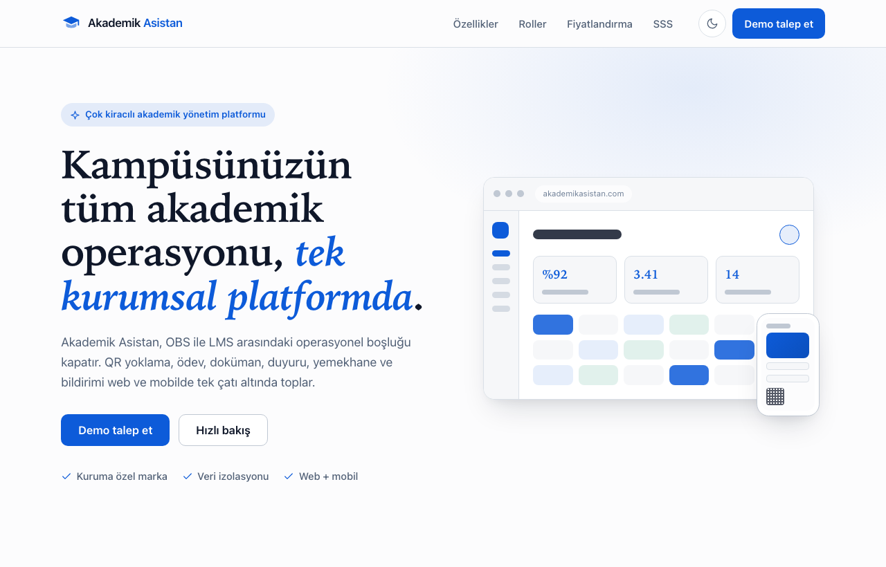
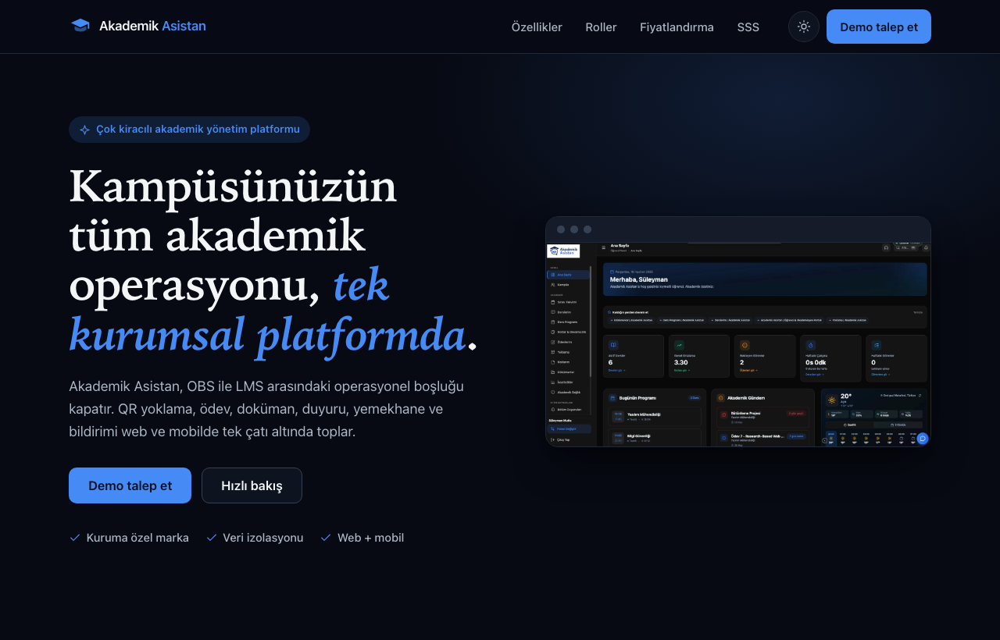
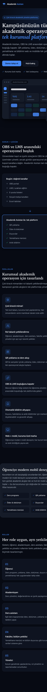

# Akademik Asistan — Kurumsal Tanıtım Sayfası

[](https://github.com/csmutlu/akademik-asistan-landing/actions/workflows/ci.yml)

**Akademik Asistan**, üniversitelere SaaS modeliyle sunulan **çok kiracılı (multi-tenant) kurumsal akademik yönetim platformudur.** Bu repo, ürünün tek sayfalık **tanıtım (landing) sayfasını** ve sayfada kullanılan **sıfırdan yazılmış UI bileşen kütüphanesini** içerir.

Sayfa; OBS ile LMS arasındaki operasyonel boşluğu (QR yoklama, ödev, doküman, duyuru, yemekhane, bildirim) tek platformda kapatma değer önermesini kurumsal karar vericilere anlatır.

- **Canlı demo:** https://akademikasistan.com/ veya https://tanitim.akademikasistan.com/
- **Stack:** Vite + React + TypeScript + SCSS — harici UI kütüphanesi yok.

## Ekran görüntüleri

| Açık tema                                        | Koyu tema                                       |
| ------------------------------------------------ | ----------------------------------------------- |
|  |  |

<details>
<summary>Mobil görünüm</summary>



</details>

## Öne çıkanlar

- **Bileşen kütüphanesi (harici UI yok):** `Button`, `Input`, `Card`, `Modal`, `Accordion` — her biri ayrı klasör, `.module.scss` ve props ile yapılandırılabilir.
- **Tema:** CSS değişkenleriyle açık/koyu; başlangıç değeri sistem tercihi veya kalıcı seçim, FOUC önleyici boyama-öncesi script.
- **Duyarlı:** mobil öncelikli; üç kırılım (≤640 · 641–1024 · ≥1025).
- **Erişilebilirlik:** semantik HTML, atlama bağlantısı, `label-for`, aria nitelikleri, klavye gezinmesi (modal odak tuzağı, accordion ok tuşları), görünür odak halkaları, `prefers-reduced-motion`.
- **Performans:** ürün ekranları ve logo optimize WebP (boyutlandırılmış, uzun-önbellekli), sistem font yığını, yalın JS/CSS.
- **Lighthouse (masaüstü): 100 / 100 / 100 / 100** — bkz. `docs/lighthouse.png`.

## Kurulum

Gereksinim: Node.js 20.19+ veya 22.12+.

```bash
npm install      # bağımlılıklar
npm run dev      # geliştirme sunucusu (http://localhost:5173)
```

## Komutlar

| Komut                | Açıklama                                      |
| -------------------- | --------------------------------------------- |
| `npm run dev`        | Geliştirme sunucusu (HMR)                     |
| `npm run build`      | Tip kontrolü + production derlemesi (`dist/`) |
| `npm run preview`    | Derlemeyi yerelde önizle                      |
| `npm run lint`       | ESLint (jsx-a11y dahil)                       |
| `npm run format`     | Prettier ile biçimlendir                      |
| `npm run typecheck`  | TypeScript tip kontrolü                       |
| `npm run test`       | Vitest (tek seferlik)                         |
| `npm run test:watch` | Vitest (izleme)                               |

## Proje yapısı

```
src/
  components/   # 5 UI bileşeni + ThemeToggle, Icon, Section, DashboardMock
  sections/     # Header, Hero, Problem, Features, StudentStrip, Roles,
                # Pricing, Faq, Contact, Footer
  hooks/        # useTheme, useScrollLock, useFocusTrap
  lib/          # content.ts (TR içerik), validators.ts (form doğrulama)
  styles/       # _tokens.scss, _mixins.scss, global.scss
docs/           # ADR'ler, ilerleme notları, ekran görüntüleri, Lighthouse
```

## Mimari notlar ve kararlar

Önemli kararlar `docs/adr-*.md` altında kayıt altındadır:

- [ADR-0001](docs/adr-0001-react-vite-typescript.md) — React + Vite + TypeScript
- [ADR-0002](docs/adr-0002-scss-modules-tema.md) — SCSS Modules + CSS değişkenli tema
- [ADR-0003](docs/adr-0003-kendi-bilesen-kutuphanesi.md) — Kendi bileşen kütüphanesi
- [ADR-0004](docs/adr-0004-erisilebilirlik.md) — Erişilebilirlik yaklaşımı
- [ADR-0005](docs/adr-0005-performans.md) — Performans: CSS önizleme ve sistem fontları

Kısa özet:

- **Tema** tek kaynaktan (`_tokens.scss`) CSS değişkenleriyle yönetilir; bileşenler renkleri doğrudan değişkenlerden okur, böylece açık/koyu otomatik çalışır.
- **Bileşenler** birleştirilebilir ve sunum/iş mantığı ayrıdır; durum (tema, modal, form) yerel ve öngörülebilir tutulur.
- **İçerik** `src/lib/content.ts` içinde toplanır; bölümler veriyi map'leyerek render eder.

## Erişilebilirlik

- Tek `h1`, ardından bölüm başlıkları (`h2`/`h3`) ile mantıklı başlık hiyerarşisi.
- Tüm form alanları `label`–`for` ile bağlı; hatalar `aria-invalid` + `aria-describedby` ile duyurulur.
- Modal: `role="dialog"`, `aria-modal`, odak tuzağı, Esc ile kapatma, odağı geri verme.
- Accordion: `aria-expanded`/`aria-controls`, ok/Home/End ile klavye gezinmesi.
- `prefers-reduced-motion` ve `:focus-visible` desteklenir.

## Performans

Lighthouse masaüstü ölçümünde dört kategoride de 100. Ürün ekran görüntüleri ve logo optimize WebP olarak (gösterim boyutuna göre ölçeklenmiş, `immutable` önbellekli) servis edilir; sistem font yığını ve yalın paket sayesinde görsel/font ağ yükü düşük tutulur (`docs/lighthouse.png`).

## Dağıtım

- **Cloudflare Pages (otomatik):** depo Cloudflare Pages'e bağlıdır; `main`'e her push'ta proje (`akademik-asistan`) `npm ci && npm run build` ile derlenip `dist` yayımlanır. Ayrı bir GitHub Actions deploy iş akışı yoktur.
- **Direct upload:** `npm run build` sonrası `npx wrangler pages deploy dist --project-name akademik-asistan` komutu production deploy oluşturur.
- **Özel alan adları:** Cloudflare Pages projesindeki **Custom domains** bölümüne `akademikasistan.com` ve `tanitim.akademikasistan.com` eklenmelidir. `akademikasistan.com` başka bir Pages projesine bağlıysa önce oradan kaldırılmalıdır.
- **Static config:** `public/_headers` güvenlik/cache header'larını, `public/_redirects` ise SPA fallback kuralını üretim build'ine taşır.
- **Alternatif:** depo Vercel veya Netlify'a bağlanabilir (`vercel.json` / `netlify.toml` hazır).

## Katkı / dal akışı

`main` korumalıdır (PR + CI zorunlu). Geliştirme `dev` dalında; özellikler `feat/*`, düzeltmeler `fix/*` dallarında yapılır ve PR ile `dev`'e birleştirilir. Commit mesajları [Conventional Commits](https://www.conventionalcommits.org/) biçimindedir.

## Lisans

[MIT](LICENSE)
